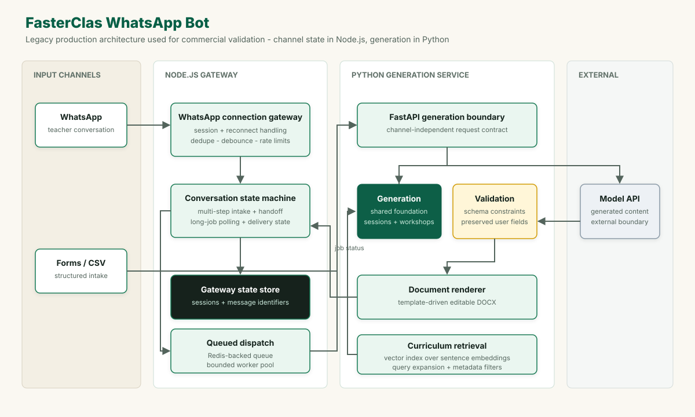

# FasterClas WhatsApp Bot

A conversational AI product that generated planning documents for teachers in
Peru and delivered them over WhatsApp, backed by a Python document-generation
service. It ran the intake, generation, delivery and support workflow inside a
chat thread.

**Status:** superseded by
[FasterClas Platform](https://github.com/sharmelyvi/fasterclas-platform), a
self-service web product shaped by this system's production constraints

## Engineering summary

- Split channel management and generation into Node.js and Python runtimes with
  an explicit service boundary.
- Modeled WhatsApp intake as conversation state with message deduplication,
  reconnect handling, and human handoff.
- Bounded an openly reachable channel with per-sender request limits, a
  sliding-window rate limiter, and a circuit breaker around model calls.
- Generated coherent document sets from a shared planning foundation while
  preserving teacher-provided titles and curriculum areas.
- Ran retrieval in the production generation path over a ChromaDB index with
  MiniLM embeddings, query expansion, and metadata filters.
- Decoupled inbound messages from generation with a Redis-backed queue and a
  worker pool, so a slow generation never blocked message intake.

## Product

- Collected structured requirements through forms, structured file uploads,
  and multi-step WhatsApp conversations.
- Generated a shared project foundation before individual sessions and
  workshops, keeping the document set internally coherent.
- Preserved teacher-provided titles and curriculum areas instead of silently
  replacing them with generated output.
- Handed a conversation to a person when the workflow could not resolve it.

## System architecture

[](./architecture.svg)

The product used two runtimes with a clear ownership boundary. A Node.js
gateway using Baileys owned the WhatsApp connection and conversation state.
The Python/FastAPI service owned curriculum processing, generation, validation,
and document creation. The gateway polled long-running work and delivered the
resulting files back through the active conversation.

## Why these design choices

### Open-channel controls

A published WhatsApp number is open ingress: any sender can trigger paid model
work. Rapid messages from one sender were debounced into a single request, a
sliding-window rate limiter gated calls to the model provider, and a circuit
breaker opened after repeated failures and recovered on a timer, preventing
repeated calls from amplifying a provider outage.

### Asynchronous, stateful intake

Inbound messages were enqueued in Redis and consumed by a bounded worker pool,
keeping generation out of the channel-handling path. Multi-step intake was
modeled as explicit conversation state rather than isolated prompts, with
duplicate-event handling, reconnect paths and human handoff.

### Channel-independent generation

Generation lived behind a Python/FastAPI service with a channel-independent
contract, separating messaging concerns from curriculum logic and making the
same work reusable when FasterClas moved to the web. A shared planning
foundation was created first and fed the dependent sessions and workshops, which
reduced contradictions across documents and preserved teacher-provided titles
and curriculum areas.

### Retrieval trade-off

Curriculum examples were retrieved from a ChromaDB index over MiniLM embeddings
using query expansion and metadata filters. The retriever was injected directly
into the generators. Production use showed that retrieval was useful for finding
examples but unsuitable for selecting a workflow, a discrete decision the
successor platform routes deterministically.

## Selected implementation pattern

### Deduplication that cannot grow without bound

WhatsApp events could be delivered more than once after a reconnect, and each
duplicate could trigger paid model work. Remembering identifiers is the obvious
fix — but the gateway is a long-lived process, so unbounded memory of them is a
leak that surfaces as an incident weeks later. The set is therefore bounded twice: by age, and by size with the
oldest entries evicted first.

```javascript
const processedMessageIds = new Map();
const MESSAGE_TTL_MS = 5 * 60 * 1000;
const MAX_TRACKED_MESSAGES = 5000;

function pruneProcessedMessages(now = Date.now()) {
  for (const [id, ts] of processedMessageIds.entries()) {
    if (now - ts > MESSAGE_TTL_MS) {
      processedMessageIds.delete(id);
    }
  }

  if (processedMessageIds.size <= MAX_TRACKED_MESSAGES) return;

  const overflow = processedMessageIds.size - MAX_TRACKED_MESSAGES;
  const oldest = [...processedMessageIds.entries()]
    .sort((a, b) => a[1] - b[1])
    .slice(0, overflow);

  for (const [id] of oldest) {
    processedMessageIds.delete(id);
  }
}

function isDuplicateMessage(message) {
  const id = message.key?.id;
  if (!id) return false;

  const now = Date.now();
  pruneProcessedMessages(now);

  if (processedMessageIds.has(id)) return true;

  processedMessageIds.set(id, now);
  return false;
}
```

The deployed architecture assigned one WhatsApp account to one long-lived
gateway process. Within that ownership model, the bounded ledger provided the
required duplicate-event protection without introducing another shared-state
dependency. Replicated gateways would first externalize idempotency state.

The block is the deployed implementation with Spanish comments removed.

## Evolution into FasterClas Platform

The production constraints below shaped the successor web platform: a
self-service product with persistent accounts, block-level editing, structured
exports, and integrated billing.

| Area | Decision | Limit it revealed |
|---|---|---|
| Interface | WhatsApp as the primary surface | Chat cannot carry discoverability, editing, or document management |
| Workers | Redis queue with a bounded pool | Sufficient for validation; throughput was not the constraint observed in production |
| State | Explicit conversation state | Hard to grow into a persistent workspace a user can return to |
| Retrieval | Semantic retrieval inside generation | Useful for curriculum examples, unsuitable for deterministic workflow routing |
| Channel | QR-authenticated WhatsApp transport | Accelerated access to real-user feedback; a managed enterprise deployment would require an official transport with richer interactive controls |

## Stack

`Python` · `FastAPI` · `Pydantic` · `SQLite` · `docxtpl` · `python-docx` · `Node.js` · `Baileys` · `Redis` · `OpenAI` · `Gemini` · `Vertex AI` · `ChromaDB / MiniLM`

---

**Role:** solo founder - product, backend, AI orchestration, conversation
design, document generation, deployment, and operations.

**Repository scope:** this repository contains the engineering case study; the
production source code and customer data remain private.
